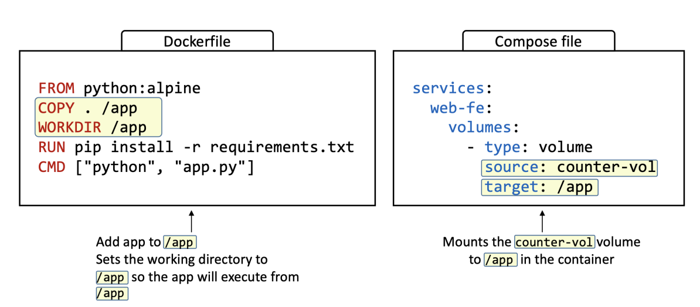

# Docker Compose

[Read Pages 107-119 of our Text Book: Docker Deep Dive by Nigel Poulton 2023 Edition](https://www.amazon.com/Docker-Deep-Dive-Nigel-Poulton/dp/1916585256)

[Docker Compose overview](https://docs.docker.com/compose/)

[Try Docker Compose](https://docs.docker.com/compose/gettingstarted/)


Deploying apps with Compose - The TLDR

Modern cloud-native apps are made of multiple smaller services that interact to form a useful app. We call this the microservices pattern.

1. Web front-end
2. Ordering
3. Catalog
4. Back-end datastore
5. Logging
6. Authentication
7. Authorization


### Prerequisites

You need to have Docker Engine and Docker Compose on your machine. You can either:

- Install [Docker Engine](https://docs.docker.com/get-docker/) and [Docker Compose](https://docs.docker.com/compose/install/) as standalone binaries
- Install [Docker Desktop](https://docs.docker.com/desktop/) which includes both Docker Engine and Docker Compose

* Be sure to use the docker compose command and not docker-compose.
 
    ```docker compose version```

## Multi Contianer App

* Go to the developer directory:

    cd flask_docker

Let’s quickly describe each file:

- compose.yaml is the Docker Compose file that describes the app and how Compose should build and deploy it
- app is a folder and contains the application code and views
- Dockerfile describes how to build the image for the web-fe service
- requirements.txt lists the application dependencies

1. Define services in a Compose file

We've named the file ```compose.yaml``` in the project directory

```
networks:
  counter-net:

services:
  web-fe:
    build: .
    command: python app.py
    ports:
      - target: 8080
        published: 5001
    networks:
      - counter-net
  redis:
    image: "redis:alpine"
    networks:
      counter-net:
```

This Compose file defines web service

The web service uses an image that's built from the Dockerfile in the current directory. It then binds the container and the host machine to the exposed port, 5001. This example service uses the default port for the Flask web server, 8080.

The ```redis``` service uses a public Redis image pulled from the Docker Hub registry.


2. Build and run your app with Compose

* From your project directory, start up your application by running docker compose up.

     docker compose up

* Using Postman use the following base URL:

    http://127.0.0.1:5001/


3. Edit the Compose file to add a bind mount

Edit the ```compose.yaml``` file in your project directory to add a [bind mount](https://docs.docker.com/storage/bind-mounts/) for the web service:

```
networks:
  counter-net:

services:
  web-fe:
    build: .
    command: python app.py
    ports:
      - target: 8080
        published: 5001
    networks:
      - counter-net
    volumes:
      - type: bind
        source: .\    # For Linux, use / backward slash to navigate to the current directory.
        target: /app
  redis:
    image: "redis:alpine"
    networks:
      counter-net:
```

4. Re-build and run the app with Compose

From your project directory, type docker compose up to build the app with the updated Compose file, and run it.

    docker compose up

* List Images

    docker images

* List Process

    docker ps

* List Network

    docker network ls

* List Volume

    docker volume ls

* As the application is already up, let’s see how to bring it down. To do this, replace the up sub-command with down.

    docker compose down

* Use the following command to bring the app up again, but this time in the background.

    docker compose up --detach

* Show the current state of the app with the docker compose ps command.

    docker compose ps

* Use docker compose top to list the processes running inside of each service
 (container).

    docker compose top

* Use the docker compose stop command to stop the app without deleting its resources. Then show the status of the app with docker compose ps.

    docker compose stop

    docker compose ps

* Previous versions of Compose used to list the containers in the stopped state. Verify that the containers for the two Compose microservices still exist on the system and are in the stopped state.

    docker ps -a

* With the app in the stopped state, restart it with the docker compose restart command.
    
    docker compose restart

* Verify the operation app is back up.

    docker compose ls

* Run the following command to stop and delete the app with a single command. It
will also delete any volumes and images used to start the app.

    docker-compose down --volumes --rmi all

* Using volumes to insert data

Let’s deploy the app one last time and see a little more about how the volume works.

    docker compose up --detach

If you look in the Compose file, you’ll see it defines a volume called counter-vol and mounts it in to the web-fe container at /app.

```
volumes:
  counter-vol:
services:
  web-fe:
volumes:
- type: volume
  source: counter-vol
  target: /app
```

* The first time we deployed the app, Compose checked to see if a volume called counter-vol already existed. It didn’t, so Compose created it. You can see it with the docker volume ls command, and you can get more detailed information with docker volume inspect multi-container_counter-vol.

    docker volume ls

    docker volume inspect multi-container_counter-vol

    

This means we can make changes to files in the volume, from the outside of the container, and have them reflected immediately in the app. Let’s see how that works.

The next steps will walk you through the following process.

- Update the contents of app/templates/index.html in the project’s build context
- Copy the updated index.html to the container’s volume (this resides on the Docker host’s filesystem)
- Refresh the web page and see the updates

Use your favourite text editor to edit the index.html. 

Change text on line 16 to the following and save your changes.
```<h2>Your Name</h2>```

* Now that you’ve updated the app, you need to copy it into the volume on the Docker host. Each Docker volume exists at a location within the Docker host’s filesystem. Use the following docker inspect command to find where the volume is exposed on the Docker host.

     docker inspect multi-container_counter-vol | grep Mount